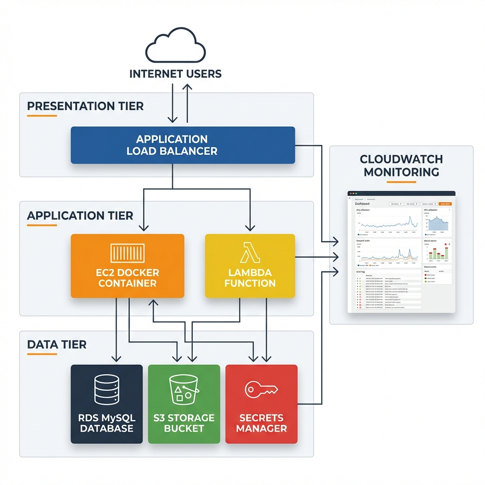

# PhotoShare - 3-Tier AWS Infrastructure with Terraform

A production-ready, fully automated 3-tier web application infrastructure on AWS using Terraform. This project deploys a photo-sharing application with serverless image processing, secure database management, and comprehensive monitoring.

## 📋 Table of Contents

- [Architecture Overview](#architecture-overview)
- [Features](#features)
- [Infrastructure Components](#infrastructure-components)
- [Prerequisites](#prerequisites)
- [Project Structure](#project-structure)
- [Quick Start](#quick-start)
- [Module Details](#module-details)
- [Configuration](#configuration)
- [Deployment](#deployment)
- [Monitoring](#monitoring)
- [Security](#security)
- [Troubleshooting](#troubleshooting)
- [Clean Up](#clean-up)

## 🏗️ Architecture Overview



This project implements a **3-tier architecture** on AWS:

```
┌─────────────────────────────────────────────────────────────────┐
│                         Internet Users                          │
└────────────────────────────┬────────────────────────────────────┘
                             │
                             ▼
┌─────────────────────────────────────────────────────────────────┐
│                    PRESENTATION TIER                            │
│  ┌──────────────────────────────────────────────────────────┐  │
│  │   Application Load Balancer (ALB)                        │  │
│  │   - Public Subnets (Multi-AZ)                           │  │
│  │   - HTTP/HTTPS Traffic Distribution                      │  │
│  └──────────────────────────────────────────────────────────┘  │
└────────────────────────────┬────────────────────────────────────┘
                             │
                             ▼
┌─────────────────────────────────────────────────────────────────┐
│                    APPLICATION TIER                             │
│  ┌──────────────────────────────────────────────────────────┐  │
│  │   EC2 Instance (Docker)                                  │  │
│  │   - PhotoSharing App Container                           │  │
│  │   - Auto-configured with User Data                       │  │
│  │   - IAM Role for S3 & Secrets Manager                    │  │
│  └──────────────────────────────────────────────────────────┘  │
│  ┌──────────────────────────────────────────────────────────┐  │
│  │   Lambda Function                                        │  │
│  │   - S3 Event-Triggered Metadata Extraction               │  │
│  │   - Automatic Image Processing                           │  │
│  └──────────────────────────────────────────────────────────┘  │
└────────────────────────────┬────────────────────────────────────┘
                             │
                             ▼
┌─────────────────────────────────────────────────────────────────┐
│                      DATA TIER                                  │
│  ┌─────────────────────┐      ┌──────────────────────────────┐ │
│  │   RDS MySQL 8.4     │      │   S3 Bucket                  │ │
│  │   - Private Subnets │      │   - Encrypted (AES-256)      │ │
│  │   - Multi-AZ Ready  │      │   - Private Access Only      │ │
│  │   - db.t3.micro     │      │   - Lambda Triggers          │ │
│  └─────────────────────┘      └──────────────────────────────┘ │
│  ┌──────────────────────────────────────────────────────────┐  │
│  │   AWS Secrets Manager                                    │  │
│  │   - Database Credentials                                 │  │
│  └──────────────────────────────────────────────────────────┘  │
└─────────────────────────────────────────────────────────────────┘
                             │
                             ▼
┌─────────────────────────────────────────────────────────────────┐
│                    MONITORING & OBSERVABILITY                   │
│  ┌──────────────────────────────────────────────────────────┐  │
│  │   CloudWatch Dashboard                                   │  │
│  │   - EC2 CPU Metrics                                      │  │
│  │   - Lambda Invocations                                   │  │
│  │   - Automated Alarms                                     │  │
│  └──────────────────────────────────────────────────────────┘  │
└─────────────────────────────────────────────────────────────────┘
```

## ✨ Features

### Infrastructure as Code

- **Modular Terraform Design**: Reusable, maintainable modules for each AWS service
- **Multi-AZ Deployment**: High availability across availability zones
- **Automated Provisioning**: Complete infrastructure deployment with single command

### Security

- ✅ **Private Database**: RDS in private subnets with security group restrictions
- ✅ **Encrypted Storage**: S3 bucket with AES-256 server-side encryption
- ✅ **Secrets Management**: Database credentials stored in AWS Secrets Manager
- ✅ **IAM Best Practices**: Least privilege access with role-based permissions
- ✅ **Network Isolation**: VPC with public/private subnet separation

### Serverless Processing

- 🚀 **Event-Driven Architecture**: Lambda triggered on S3 object creation
- 🚀 **Automatic Metadata Extraction**: Image metadata processing and webhook notifications
- 🚀 **Scalable**: Serverless compute scales automatically with demand

### Monitoring & Observability

- 📊 **CloudWatch Dashboard**: Real-time metrics visualization
- 📊 **Automated Alarms**: Lambda error detection and notifications
- 📊 **Health Checks**: ALB health checks for application availability

## 🧩 Infrastructure Components

| Component         | Service                     | Purpose                                  |
| ----------------- | --------------------------- | ---------------------------------------- |
| **Networking**    | VPC, Subnets, IGW           | Network isolation and routing            |
| **Load Balancer** | Application Load Balancer   | Traffic distribution and SSL termination |
| **Compute**       | EC2 (t3.micro)              | Application hosting with Docker          |
| **Serverless**    | Lambda (Python 3.14)        | Image metadata extraction                |
| **Database**      | RDS MySQL 8.4 (db.t3.micro) | Persistent data storage                  |
| **Storage**       | S3                          | Image and asset storage                  |
| **Secrets**       | Secrets Manager             | Secure credential management             |
| **IAM**           | Roles & Policies            | Access control and permissions           |
| **Monitoring**    | CloudWatch                  | Metrics, logs, and alarms                |

## 📦 Prerequisites

Before deploying this infrastructure, ensure you have:

1. **AWS Account** with appropriate permissions
2. **Terraform** installed (v1.0+)
   ```bash
   terraform --version
   ```
3. **AWS CLI** configured with credentials
   ```bash
   aws configure
   ```
4. **SSH Key Pair** created in AWS EC2
   - Key name: `photoshare-key` (or update in `main.tf`)
5. **Lambda Deployment Package**
   - Create `lambda.zip` containing the Lambda function code

## 📁 Project Structure

```
tf3tier/
├── main.tf                      # Root module - orchestrates all infrastructure
├── provider.tf                  # AWS provider configuration
├── outputs.tf                   # Root-level outputs
├── readme.md                    # This file
│
├── modules/                     # Reusable Terraform modules
│   ├── vpc/                     # Virtual Private Cloud
│   │   ├── main.tf              # VPC, subnets, IGW, route tables
│   │   ├── outputs.tf           # VPC ID, subnet IDs
│   │   └── variables.tf         # VPC configuration variables
│   │
│   ├── alb/                     # Application Load Balancer
│   │   ├── main.tf              # ALB, target groups, listeners
│   │   ├── outputs.tf           # ALB DNS, security group ID
│   │   └── variables.tf         # ALB configuration variables
│   │
│   ├── ec2/                     # EC2 Web Server
│   │   ├── main.tf              # EC2 instance, security groups, user data
│   │   ├── outputs.tf           # Instance ID, public IP
│   │   └── variables.tf         # EC2 configuration variables
│   │
│   ├── rds/                     # RDS MySQL Database
│   │   ├── main.tf              # RDS instance, subnet group, security group
│   │   ├── outputs.tf           # Database endpoint, security group ID
│   │   └── variables.tf         # Database configuration variables
│   │
│   ├── s3/                      # S3 Storage
│   │   ├── main.tf              # S3 bucket, encryption, access controls
│   │   ├── outputs.tf           # Bucket name, ARN
│   │   └── variables.tf         # S3 configuration variables
│   │
│   ├── lambda/                  # Lambda Function
│   │   ├── main.tf              # Lambda function, permissions, S3 triggers
│   │   ├── outputs.tf           # Lambda function name, ARN
│   │   └── variables.tf         # Lambda configuration variables
│   │
│   ├── iam/                     # IAM Roles & Policies
│   │   ├── main.tf              # EC2 role, Lambda role, policies
│   │   └── outputs.tf           # Role ARNs, instance profile
│   │
│   ├── secretms/                # Secrets Manager
│   │   ├── main.tf              # Secret creation and version
│   │   ├── outputs.tf           # Secret ARN
│   │   └── variables.tf         # Secret configuration variables
│   │
│   └── cloudwatch/              # CloudWatch Monitoring
│       ├── main.tf              # Dashboard, alarms
│       ├── outputs.tf           # Dashboard URL
│       └── variables.tf         # Monitoring configuration variables
│
├── assets/                      # Application assets and scripts
│   ├── docker-compose.yml       # Docker Compose configuration for EC2
│   ├── lambda_function.py       # Lambda function source code
│   └── scripts.sh               # Manual EC2 setup scripts
│
└── lessons/                     # Learning materials
    ├── lesson1.md               # Terraform basics
    └── lesson2.md               # Advanced concepts
```

## 🚀 Quick Start

### 1. Clone and Configure

```bash
# Navigate to the project directory
cd tf3tier

# Update the S3 bucket name (must be globally unique)
# Edit main.tf, line 49
bucket_name = "photoshare-assets-YOUR-UNIQUE-ID"
```

### 2. Prepare Lambda Function

```bash
# Create Lambda deployment package
cd assets
zip -r ../lambda.zip lambda_function.py
cd ..
```

### 3. Initialize Terraform

```bash
# Initialize Terraform and download providers
terraform init
```

### 4. Review Infrastructure Plan

```bash
# See what will be created
terraform plan
```

### 5. Deploy Infrastructure

```bash
# Deploy all resources
terraform apply

# Type 'yes' when prompted
```

### 6. Get Outputs

```bash
# View important outputs
terraform output

# Example outputs:
# alb_dns_name = "photoshare-alb-1234567890.us-east-1.elb.amazonaws.com"
# ec2_public_ip = "54.123.45.67"
# rds_endpoint = "photoshare-db.abc123.us-east-1.rds.amazonaws.com:3306"
```

### 7. Access Application

```bash
# Open in browser
http://<alb_dns_name>

# Or use curl
curl http://<alb_dns_name>
```

## 📚 Module Details

### VPC Module (`modules/vpc`)

Creates the network foundation:

- **VPC**: 10.0.0.0/16 CIDR block
- **Public Subnet**: 10.0.1.0/24 (for ALB and EC2)
- **Private Subnet**: 10.0.2.0/24 (for RDS)
- **Internet Gateway**: Public internet access
- **Route Tables**: Public subnet routing

**Outputs**: `vpc_id`, `public_subnets`, `private_subnets`

### ALB Module (`modules/alb`)

Configures load balancing:

- **Security Group**: Allows HTTP (80) and SSH (22)
- **Application Load Balancer**: Internet-facing, multi-AZ
- **Target Group**: HTTP health checks on port 80
- **Listener**: Forwards HTTP traffic to target group

**Outputs**: `alb_dns_name`, `alb_sg_id`, `target_group_arn`

### EC2 Module (`modules/ec2`)

Deploys application server:

- **Instance Type**: t3.micro (free tier eligible)
- **AMI**: Amazon Linux 2023
- **User Data**: Automated Docker and app deployment
- **Security Group**: Allows traffic from ALB and SSH
- **IAM Role**: S3 and Secrets Manager access

**User Data Automation**:

1. Installs Docker and Docker Compose
2. Creates `.env` file with S3 bucket and secret name
3. Deploys PhotoShare app container
4. Registers with ALB target group

**Outputs**: `instance_id`, `public_ip`

### RDS Module (`modules/rds`)

Manages database:

- **Engine**: MySQL 8.4
- **Instance Class**: db.t3.micro
- **Storage**: 20GB GP3
- **Credentials**: admin/admin123 (change in production!)
- **Database Name**: photoshare
- **Subnet Group**: Private subnets only
- **Security Group**: MySQL (3306) from VPC only

**Outputs**: `db_endpoint`, `db_sg_id`

### S3 Module (`modules/s3`)

Handles object storage:

- **Bucket Name**: photoshare-assets-12345 (configurable)
- **Encryption**: AES-256 server-side encryption
- **Public Access**: Blocked (all settings)
- **Versioning**: Disabled (can be enabled)

**Outputs**: `bucket_name`, `bucket_arn`

### Lambda Module (`modules/lambda`)

Serverless image processing:

- **Runtime**: Python 3.14
- **Handler**: lambda_handler.lambda_handler
- **Trigger**: S3 ObjectCreated events
- **Environment Variables**:
  - `S3_BUCKET`: Target bucket name
  - `ALB_DNS`: Application endpoint
- **Permissions**: S3 invoke permission

**Functionality**:

1. Triggered when image uploaded to S3
2. Extracts metadata (size, type, key)
3. Sends webhook to ALB endpoint `/api/webhook`

**Outputs**: `lambda_name`, `lambda_arn`

### IAM Module (`modules/iam`)

Access management:

**EC2 Role**:

- AmazonS3FullAccess
- AWSSecretsManagerReadOnlyAccess
- Instance profile for EC2 attachment

**Lambda Role**:

- AWSLambdaBasicExecutionRole
- AmazonS3FullAccess

**Outputs**: `ec2_instance_profile`, `lambda_role_arn`

### Secrets Manager Module (`modules/secretms`)

Secure credential storage:

- **Secret Name**: photoshare/db/credentials
- **Format**: JSON with username, password, host, port, dbname
- **Access**: EC2 instances via IAM role

**Outputs**: `secret_arn`

### CloudWatch Module (`modules/cloudwatch`)

Monitoring and alerting:

**Dashboard**: PhotoShare-Monitor

- EC2 CPU Utilization (5-min average)
- Lambda Invocations (total count)

**Alarms**:

- Lambda error detection (threshold: 0)
- Email notifications (configure SNS topic)

**Outputs**: `dashboard_name`

## ⚙️ Configuration

### Required Variables

Update these in `main.tf`:

```hcl
# S3 Bucket (must be globally unique)
bucket_name = "photoshare-assets-YOUR-UNIQUE-ID"

# EC2 Key Pair (must exist in AWS)
key_name = "photoshare-key"

# Database Credentials (change for production!)
db_username = "admin"
db_password = "admin123"
```

### Optional Customizations

**Change AWS Region**:

```hcl
# In provider.tf
provider "aws" {
  region = "us-west-2"  # Change as needed
}
```

**Modify Instance Type**:

```hcl
# In modules/ec2/main.tf
instance_type = "t3.small"  # Upgrade for more resources
```

**Enable Multi-AZ for RDS**:

```hcl
# In modules/rds/main.tf
multi_az = true
```

## 🔧 Deployment

### Step-by-Step Deployment

1. **Validate Configuration**

   ```bash
   terraform validate
   ```

2. **Format Code**

   ```bash
   terraform fmt -recursive
   ```

3. **Plan Deployment**

   ```bash
   terraform plan -out=tfplan
   ```

4. **Apply Changes**

   ```bash
   terraform apply tfplan
   ```

5. **Verify Resources**

   ```bash
   # Check EC2 instance
   aws ec2 describe-instances --filters "Name=tag:Name,Values=photoshare-web"

   # Check ALB
   aws elbv2 describe-load-balancers --names photoshare-alb

   # Check RDS
   aws rds describe-db-instances --db-instance-identifier photoshare-db
   ```

### Deployment Time

- **Total Duration**: ~10-15 minutes
- **RDS Creation**: ~8-10 minutes (longest component)
- **EC2 Initialization**: ~2-3 minutes (user data execution)

## 📊 Monitoring

### CloudWatch Dashboard

Access the dashboard:

1. AWS Console → CloudWatch → Dashboards
2. Select "PhotoShare-Monitor"

**Metrics Available**:

- EC2 CPU Utilization
- Lambda Invocations
- Lambda Errors
- Lambda Duration

### View Logs

**EC2 Logs**:

```bash
# SSH into EC2 instance
ssh -i photoshare-key.pem ec2-user@<ec2_public_ip>

# View Docker logs
sudo docker logs photosharing-app
```

**Lambda Logs**:

```bash
# Using AWS CLI
aws logs tail /aws/lambda/photoshare-metadata-extractor --follow
```

### Alarms

**Lambda Error Alarm**:

- Triggers when Lambda function errors occur
- Evaluation: 1 period of 60 seconds
- Action: (Configure SNS topic for notifications)

## 🔒 Security

### Security Best Practices Implemented

✅ **Network Security**:

- Private subnets for database
- Security groups with least privilege
- No direct internet access to RDS

✅ **Data Security**:

- S3 encryption at rest (AES-256)
- RDS encryption (enable in production)
- Secrets Manager for credentials

✅ **Access Control**:

- IAM roles instead of access keys
- Instance profiles for EC2
- Least privilege policies

✅ **Application Security**:

- ALB health checks
- Security group rules
- VPC isolation

### Security Recommendations for Production

⚠️ **Change Default Credentials**:

```hcl
# Use strong, randomly generated passwords
db_password = random_password.db_password.result
```

⚠️ **Enable RDS Encryption**:

```hcl
storage_encrypted = true
kms_key_id        = aws_kms_key.rds.arn
```

⚠️ **Enable HTTPS**:

```hcl
# Add SSL certificate to ALB
certificate_arn = "arn:aws:acm:..."
```

⚠️ **Enable VPC Flow Logs**:

```hcl
resource "aws_flow_log" "vpc" {
  vpc_id = aws_vpc.main.id
  # ... configuration
}
```

⚠️ **Enable CloudTrail**:

```bash
aws cloudtrail create-trail --name photoshare-trail
```

## 🐛 Troubleshooting

### Common Issues

**1. S3 Bucket Name Already Exists**

```
Error: Error creating S3 bucket: BucketAlreadyExists
```

**Solution**: Change `bucket_name` to a globally unique value in `main.tf`

**2. Key Pair Not Found**

```
Error: InvalidKeyPair.NotFound
```

**Solution**: Create key pair in AWS EC2 console or update `key_name` in `main.tf`

**3. Application Not Accessible**

```
Error: Connection timeout
```

**Solution**:

- Check security group rules
- Verify EC2 instance is running
- Check ALB target health: `aws elbv2 describe-target-health`

**4. Lambda Function Errors**

```
Error: Lambda function failed
```

**Solution**:

- Check CloudWatch logs
- Verify environment variables (S3_BUCKET, ALB_DNS)
- Ensure Lambda has S3 permissions

**5. Database Connection Failed**

```
Error: Can't connect to MySQL server
```

**Solution**:

- Verify security group allows traffic from EC2
- Check RDS endpoint in Secrets Manager
- Ensure EC2 has Secrets Manager permissions

### Debug Commands

```bash
# Check Terraform state
terraform state list

# Show specific resource
terraform state show module.ec2.aws_instance.web

# Refresh state
terraform refresh

# View outputs
terraform output -json

# Check EC2 user data execution
ssh ec2-user@<ip> "sudo cat /var/log/cloud-init-output.log"
```

## 🧹 Clean Up

### Destroy Infrastructure

```bash
# Preview what will be destroyed
terraform plan -destroy

# Destroy all resources
terraform destroy

# Type 'yes' when prompted
```

### Manual Cleanup (if needed)

```bash
# Empty S3 bucket before destroying
aws s3 rm s3://photoshare-assets-12345 --recursive

# Delete CloudWatch log groups
aws logs delete-log-group --log-group-name /aws/lambda/photoshare-metadata-extractor
```

### Cost Estimation

**Monthly Costs** (us-east-1, approximate):

- EC2 t3.micro: $7.50/month
- RDS db.t3.micro: $15/month
- ALB: $16/month + data transfer
- S3: $0.023/GB stored
- Lambda: Free tier (1M requests/month)
- **Total**: ~$40-50/month

## 📝 Additional Resources

### Application Details

**PhotoShare App**:

- Docker Image: `kodekloud/photosharing-app`
- Port: 8000 (mapped to 80)
- Health Check: `/health`
- API Webhook: `/api/webhook`

**Environment Variables**:

- `S3_BUCKET`: S3 bucket for image storage
- `AWS_SECRET_NAME`: Secrets Manager secret name

### Useful Commands

```bash
# Test ALB endpoint
curl http://<alb_dns_name>/health

# Upload test image to S3
aws s3 cp test-image.jpg s3://photoshare-assets-12345/

# View Lambda invocations
aws lambda list-functions
aws lambda get-function --function-name photoshare-metadata-extractor

# Check RDS status
aws rds describe-db-instances --db-instance-identifier photoshare-db

# View Secrets Manager secret
aws secretsmanager get-secret-value --secret-id photoshare/db/credentials
```

### Learning Resources

- [Terraform AWS Provider Documentation](https://registry.terraform.io/providers/hashicorp/aws/latest/docs)
- [AWS Well-Architected Framework](https://aws.amazon.com/architecture/well-architected/)
- [Terraform Best Practices](https://www.terraform-best-practices.com/)


---


